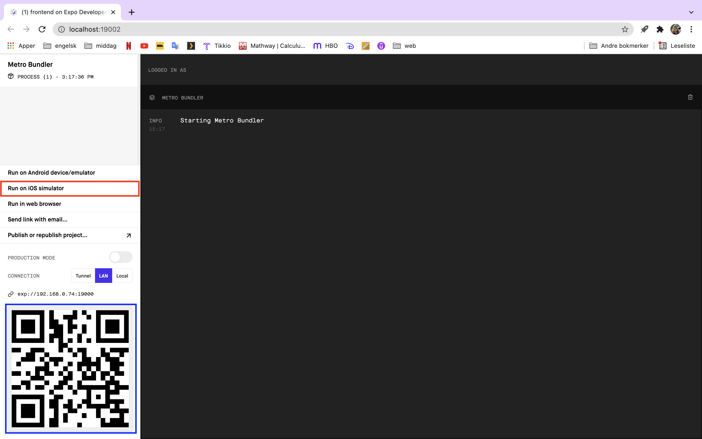

# Prosjekt 4 - React Native klient
I prosjekt 4 har vi valgt følgende oppgave:

"Lag en React Native client hvor dere gjenbruker backend og det som kan gjenbrukes av kode og logikk for klienten (bruk expo-cli)"

## Begrunnelse for backend

Vårt prosjekt viser alle Marvel Cinematic Universe filmer, og gir bruker mulighet til å søke, sortere og gi ratings til filmene. Ettersom det kun finnes et visst antall MCU-filmer hadde vi ikke behov for å hente store mengder data fra API. Vi tolket oppgaven som at data skulle hentes fra en database opprettet og vedlikeholdt av medlemmene på gruppen, og valgte derfor å fokusere på læringsutbytte i databasemanipulasjon og la inn data manuelt via mongoDB shell ettersom vi uansett ikke trengte mer enn de 24 filmene Marvel har gitt ut. Vi føler dette viser minst like god kunnskap i behandling av data som å hente ferdig json-stringer fra et eksternt API og legge inn med addMany-funksjonen til mongoDB, selv om vi ser at mange andre grupper har løst det på den måten. Da det ikke står eksplisitt i oppgaven at data skal hentes eksternt mener vi dette var en helt egnet løsning. Vi forstår selvfølgelig at denne løsningen ikke er bærekraftig i forhold til skalering, men tolket ikke skalering av database som et vurderingskrav i denne oppgaven. 

## Begrunnelse for valg av oppgave 

Da vi sto ovenfor prosjekt 4, vurderte vi flere alternativer:    
    a) Opprette ny database der data hentes fra eksternt API    
    b) Fikse småfeil i prosjekt 3 og utvide testing    
    c) Lage appen vår på nytt i React Native    

Konsekvensene av valg **a)** ville vært at vi hadde måtte endre total struktur og logikk i prosjektet. Hele poenget med vår nettside er informasjon om Marvel-filmer, og da det ikke er flere Marvelfilmer å hente ettersom det ikke finnes flere filmer i Marvel Cinematic Universe enn de vi allerede har, ville ikke henting av fra API utvidet databasen. Dette ville da heller ikke bli vist fysisk på nettsiden som en forbedring fra prosjekt 3. Dersom vi skulle vist frem mer data, hadde vi måttet hente flere filmer (f.eks. alle fra imdb), noe som ikke gir mening for omfanget av vår nettside, som kun omhandler filmene i Marvel-universet. Filmene våre sorteres også på sekvensnummer, som beskriver rekkefølgen kronologisk i dette universet. Sekvensnummer vil da ikke gi mening utenfor omfanget av disse filmene, og sammenhengen de har til hverandre. Derav måtte vi ha endret på hele strukturen og funksjonaliteten til nettsiden vår, noe vi ikke helt ser nytten av da det ikke ville gitt oss noe ny læringsutbytte i forhold til forrige prosjekt.

Valg **b)** ville bl.a. inneholde tillegg av pagination, mulighet til å se mer info om dataen vi henter, samt utvidelse av tester både i cypress og jest. Vi valgte derimot å gå for valg **c)**, da vi føler vi kan implementere disse forbedringene (med unntak av tester) likevel, samtidig som vi får læringsutbytte og viser kunnskaper i React Native. Vi mener denne oppgaven gir mest profitt knyttet til både læring og forbedring i forhold til tidsbruk. Det gir oss i tillegg muligheten til å rette opp i de manglene vi hadde fra prosjekt3, blant annet med å oppdatere litt i databasen og front-end.

For å utvide backend litt i prosjekt 4 har vi valgt å legge til pagination i graphQL-resolversene, noe vi ikke hadde i prosjekt 3. Grunnen til dette var at vi ikke så på det som nødvendig da vi hadde relativt lite data å laste av gangen, men ettersom pagination er et læringsmål, og det gir mer mening i mobile view der få objekter kan vises av gangen, ser vi på det som en naturlig utvidelse i prosjekt 4. Dette er implementert ved FlatList, som render objektene “lazily”. Med en såpass liten database kunne vi fint brukt ScrollView, men for potensiell utvidelse blir dette den beste løsningen. Mer om forskjellen mellom FlatList og ScrollView kan man se [her](https://reactnative.dev/docs/scrollview). 

Vi har også valgt å legge inn muligheten for å vise mer informasjon om hvert objekt, noe som er en intuitiv utvidelse når vi nå bruker React Native og utvikler for mobil. 

## Forskjeller og likheter fra React til React Native

I prosjekt 4 har vi gjenbrukt mye av koden fra prosjekt 3, særlig når det kommer til funksjonalitet som ikke direkte påvirker GUI. React Native er et mobil-rammeverk som bruker Reactjs for å bygge apper og nettsteder. Det er et såkalt “cross-platform” rammeverk, som vil si at React Native gjør det mulig å utvikle mobil-applikasjoner som kan kjøre på ulike plattformer, som for eksempel Android og iOS. I dette prosjektet har vi kun fått testet applikasjonen på iOS pga. problemer med Android emulator. Koden har likevel lagt til rette for at applikasjonen skal kunne kjøre fint på både Android og iOS. Det er også mulig å skrive plattform-spesifikk kode som tilrettelegger for at applikasjonen skal kjøre på en spesifikk plattform, og dette er noe som sees på som en av fordelene med React Native. 

Den største forskjellen fra prosjekt 3 til prosjekt 4 er hvordan brukergrensesnittet er lagt opp for å håndtere funksjonaliteten. Noen av hovedforskjellene vi har opplevd ved å gå over til en React Native klient er:
* Vanlig Reactjs bruker HTML i GUI, mens Native bruker kun JSX. Det vil si at de mye brukte HTML-tagene, som div, ikke er mulig å bruke i React Native. Erstatningen for feks div blir forskjellige typer View, som vi har brukt mye under prosjekt 4. Andre erstatninger vi har tatt i bruk er Text, Button, Alert, TextInput og FlatList, som alle importeres fra React Native sitt bibliotek.

* CSS er ikke mulig å bruke for å style komponentene i React Native, der man heller tar i bruk stylesheets.

## Kjøring og testing av prosjektet

Som nevnt er den oppdaterte backend deployet, så for å kjøre prosjektet må du igjen være på NTNU sin VPN.

Du bruker kommandoene    
    **cd frontend    
    npm start**
    
i terminal for å starte. Da vil du i nettleser få opp Metro Bundler.

Her trykker du på “Run on iOS simulator” (markert i rød), eller så kan du bare taste “i” i terminalen du starter applikasjonen i. For å kjøre det her kreves det at du har en iOS simulator, som du får gjennom Xcode på mac. 

Ingen på gruppen hadde mulighet til å teste i Android device/emulator, så vi har kun brukt iOS for å testing av applikasjonen. Forhåpentligvis skal det fungere fint her og, men om du merker noen problemer ber vi at du prøver å få testet i iOS. 

Prøver du å åpne i web browser vil det meste av funksjonalitet være der, men den er ikke optimal og ser merkelig ut at styling og oppsett fordi det ikke er ment for å være i web. 

Dersom mobilen din er på NTNU sin VPN kan du scanne QR-koden (markert i blått). Dette krever at du har lastet ned Expo Go fra App Store. 

På iOS simulatoren skal det se slik ut når appen er startet:

Vi har lagt ved en demo på hvordan prosjektet ser ut og kjører i iOS Simulator. Det er litt hakkete på scrolling fordi skjermen er litt liten og du må holde inne museknappen for kunne scrolle. Brukeropplevelsen er bedre om du bruker Expo Go på mobil. 

Når du trykker på “Chronological Order” sorter den filmene i kronologisk rekkefølge, mens “Release Year” sorterer på utgivelsesår. Dersom to er utgitt i samme år, blir de sortert på tittel. Når applikasjonen starter er default satt til “Chronological Order”. 
Hvis du søker på noe vil alle filmer som har søkeordet i tittelen komme frem. Disse er ennå sortert etter valget ditt. Trykker du på Reset movies vises alle filmene igjen. Du vil ennå være på samme sted i listen som du har scrollet deg til (vil altså ikke havne på toppen, som man ville gjort hvis hele siden ble refreshet). 
Vi henter 3 filmer av gangen fra databasen, og ved scrolling vil tre nye (eller 1-2, når man nærmer seg slutten av søket) lastes inn av gangen og legges til fremvisningen. 
Det er kun bildene som dukker opp, men trykker man på et bilde vil det poppe opp et modalvindu, som har coverbildet, tittel, utgivelsesår og en rating. Her kan du endre ratingen til filmen, ved å trykke på stjernene. Du kommer deg ut av modalvinduet ved å trykke på “Close” eller bakgrunnen utenfor. 
